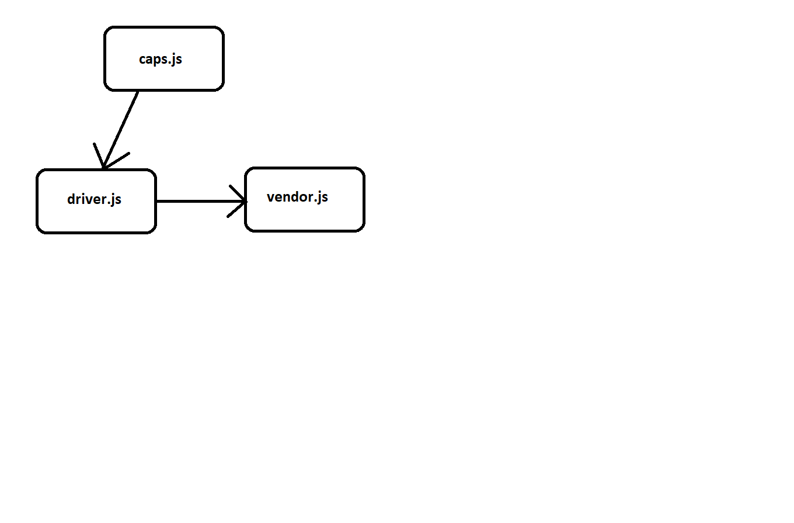

## Project: Chat Project 

### Author: Yazan Aljamal

### Links and Resources

* [submission PR](https://github.com/yaljamal-401-advanced-javascript/caps/pull/3)

### Documentation

## to run the application the show the data use this command

> node caps.js (it should be the first node)
> node driver.js 
> node vender.js

### Setup

* install  jest  , dotenv ,faker

## Tests
Test:
 node index.js / npm test / npm run lint

#### UML

